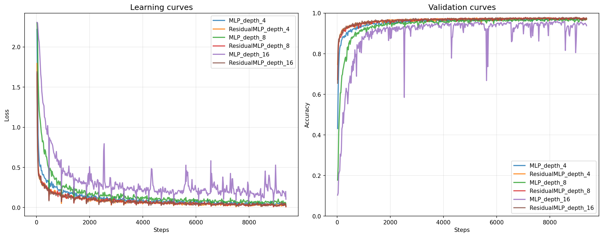
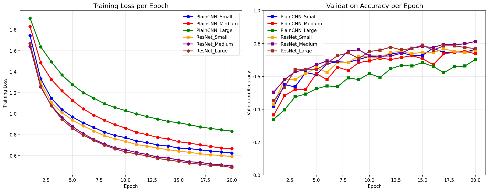
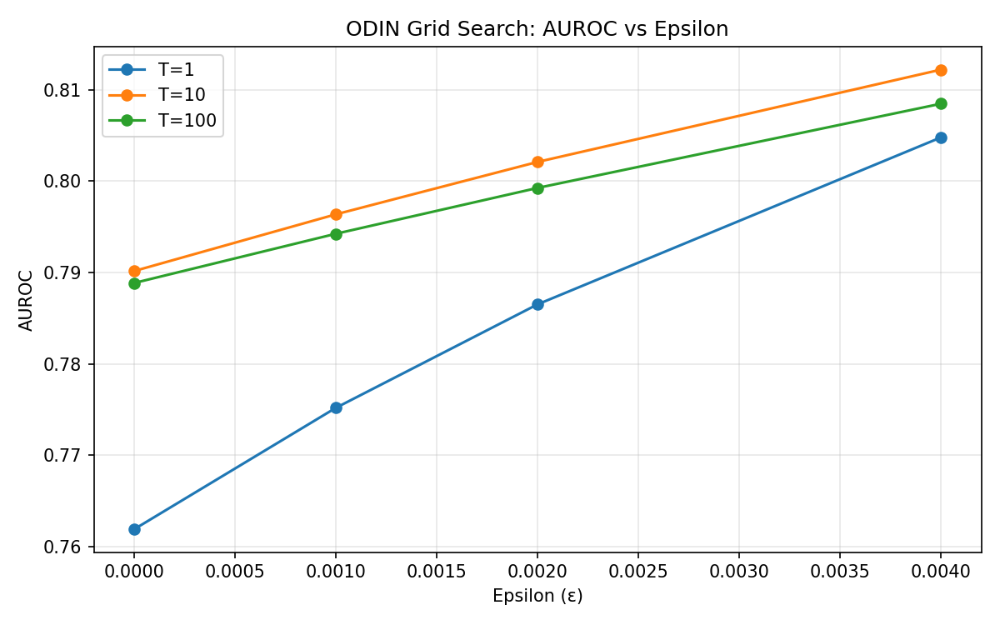
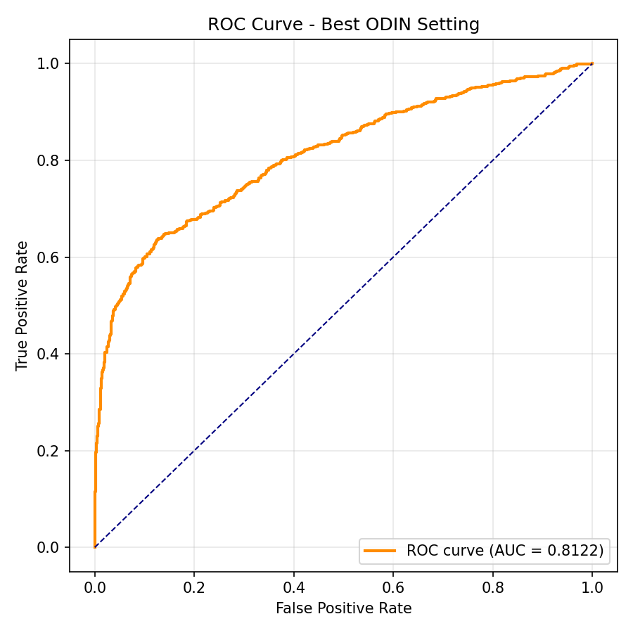

# Deep Learning Applications Laboratory 
A comprehensive collection of deep learning experiments covering fundamental concepts to advanced techniques.

## Laboratories Overview

# Lab 1: ResNet Paper Replication 

This laboratory demonstrates the key insights of ResNet through a series of progressively complex experiments, from simple MLPs on MNIST to advanced transfer learning on CIFAR datasets.

##  Objective

Replicate and understand the core findings of the ResNet paper:
- **Deeper networks don't guarantee better performance** without proper architecture
- **Residual connections enable training of very deep networks**
- **Skip connections solve the vanishing gradient problem**
- **Transfer learning benefits from well-trained feature extractors**

##  Experiments & Results

### Exercise 1.1-1.2: MLP vs ResidualMLP (MNIST) 

**Objective**: Demonstrate that residual connections solve vanishing gradient problems in deep networks

<div align="center">

</div>


**Key Findings**:
- **Standard MLP (16 layers)**: Severe training instability, poor convergence (~60-80% accuracy)
- **ResidualMLP (16 layers)**: Stable training, consistent convergence (>95% accuracy)
- **Critical Insight**: Skip connections enable training of much deeper networks without degradation

---

### Exercise 1.3: PlainCNN vs ResNet (CIFAR-10) 

**Objective**: Demonstrate degradation problem in deep CNNs and ResNet's solution

<div align="center">

</div>

**Key Findings**:
- **PlainCNN Large**: Performance degrades significantly with depth (~68% accuracy)
- **ResNet Large**: Consistent improvement with depth (~78% accuracy)
- **Training Dynamics**: ResNets show smoother loss curves and faster convergence

| Architecture | Size | Depth | Final Accuracy | Training Convergence |
|--------------|------|-------|----------------|---------------------|
| PlainCNN | Small | [2,2] | ~76% | Stable |
| PlainCNN | Medium | [5,5] | ~74% | Some degradation |
| PlainCNN | Large | [7,7] | **~68%** | **Clear degradation** |
| ResNet | Small | [2,2] | ~76% | Stable |
| ResNet | Medium | [5,5] | ~77% | Improved |
| ResNet | Large | [7,7] | **~78%** | **Best performance** |

**Critical Insight**: PlainCNNs exhibit the "degradation problem" - deeper networks perform worse even on training data. ResNets completely solve this issue.

---

### Exercise 2.1: Transfer Learning (CIFAR-10 → CIFAR-100) 

**Objective**: Explore transfer learning strategies and fine-tuning approaches

#### Phase 1: Feature Extraction Baseline
- **Method**: Linear SVM on frozen ResNet features
- **Result**: **18.5% accuracy** on CIFAR-100
- **Insight**: Pre-trained features contain useful transferable information

#### Phase 2: Fine-tuning Strategy Comparison

<div align="center" style="font-size: 12px;" >

| Strategy | Optimizer | Test Accuracy | Trainable Params |
|----------|-----------|---------------|------------------|
| Freeze Input Only | Adam | **53.30%** | 162,180 |
| No Freeze | Adam | **53.06%** | 162,644 |
| Freeze Input Only | SGD | **50.64%** | 162,180 |
| No Freeze | SGD | **49.05%** | 162,644 |
| Freeze All Early | SGD | **47.89%** | 129,188 |
| Freeze All Early | Adam | **47.86%** | 129,188 |

</div>

---

# Lab 3: Image Story Generation 

An intelligent multi-modal AI system that combines computer vision and natural language processing to automatically generate creative stories from images.

##  Objective

Create an end-to-end pipeline that:
- **Analyzes images** using state-of-the-art vision models
- **Generates descriptive captions** with BLIP (Bootstrapping Language-Image Pre-training)
- **Creates engaging narratives** using TinyStories language model
- **Demonstrates multi-modal AI integration** for creative applications

##  Architecture Pipeline

```
Image Input → BLIP Captioning → Prompt Engineering → TinyStories → Creative Story Output
```

### Core Components:
- **Vision Model**: Salesforce/blip-image-captioning-base
- **Language Model**: roneneldan/TinyStories-33M
- **Integration**: Custom prompt engineering for caption-to-story conversion

##  Generated Examples

### Example 1: Wildlife in Nature 🐻

**Input Image URL:**
`https://assets-eu-01.kc-usercontent.com/e705ccf7-e606-0153-8112-2688ed406044/77cb42b7-1ccb-4bf2-8a1f-449790c028e1/braunbaer_6039_L%282%29.jpg?w=562&fm=webp&lossless=0&q=75`

**Generated Caption:** 
*"a brown bear walking through the woods"*

**Generated Story (Medium - 164 words):**
> This is a story about a brown bear walking through the woods. One day, he decided to go for a walk and explore his surroundings. As he walked, he heard something strange coming from deep in the forest. He stopped to listen more closely.
>
> Suddenly, a voice came out of nowhere! It was an old man who lived nearby. The bear asked him what was wrong. 
>
> The old man said "I'm afraid I have no food or shelter".
>
> The bear thought for a moment and then had an idea. He told the old man that if he went back home with all his might he could find some food and shelter. So off they went, the bear carrying on until they reached a big tree full of delicious berries.
>
> They both ate as much as they wanted and soon enough they were feeling very full and happy. From that day onward, whenever the old man needed help finding food and shelter, the little bear would always be there. They became good friends and shared lots of adventures together.

---

### Example 2: Fashion & Style ✨

**Input Image URL:**
`https://www.giommifashionstore.it/media/catalog/product/cache/b5960e97f25ca6dec910676df0e6259b/G/E/GEOMETRIE.GI-000163649-AR_SN053453_01_L.jpg`

**Generated Caption:** 
*"a pair of silver glitter high heel shoes"*

**Generated Story (Short - 133 words):**
> This is a story about a pair of silver glitter high heel shoes. One day, the little girl asked her mommy if she could wear them and her mommy said yes!
>
> The little girl was so excited that she put on the sparkly shoes right away. She ran around the house in circles showing off her new outfit to everyone who came over. Everyone thought it looked very nice on her. 
>
> But then something strange happened - one of the heels started making loud noises! It scared the little girl so much that she began to cry. Her mommy quickly took off the other shoe, but it was too late - the heel had become broken into tiny pieces. The little girl was sad that her pretty shoes were now ruined forever. 
>
> She learned a valuable lesson: always be careful when wearing things you don't know about!

---

### Example 3: Natural Landscapes 🌳

**Input Image URL:**
`https://www.venditapianteonline.it/wp-content/uploads/2025/01/Quercus-robur-15.jpg`

**Generated Caption:** 
*"a large tree in the middle of a field"*

**Generated Story (Long - 173 words):**
> This is a story about a large tree in the middle of a field. One day, two little kids were walking through the woods when they saw the tree and stopped to take a closer look.
>
> The first kid said: "Wow! That's so big!" The second kid replied: "Yes it is! It looks like it might be really one minute ago." They both looked up at the huge tree with awe and wonder. Suddenly, the tree began to move and shake its branches towards them. The kids screamed out in surprise as they realized that something was coming their way.
>
> It was an old man who had been living inside the tree for many years and he was very kind and gentle. He told the kids not to worry and explained why there was no need to panic. Then he showed them how the tree could provide shelter from the rain. After hearing this, the boys felt safe and happy again. 
>
> They thanked him kindly before running off home. From then on, whenever they went into the woods, they would remember the generous elderly man and his special word.


##  Technical Implementation

### Model Configuration
```python
# BLIP Captioning
caption_model = BlipForConditionalGeneration.from_pretrained(
    "Salesforce/blip-image-captioning-base"
)

# TinyStories Generation
story_generator = pipeline(
    "text-generation", 
    model="roneneldan/TinyStories-33M"
)
```

### Generation Parameters
- **Temperature**: 0.6-0.7 (balanced creativity/coherence)
- **Top-p**: 0.9 (nucleus sampling)
- **Repetition penalty**: 1.2 (avoid loops)
- **Max tokens**: 100-200 (length control)

### Prompt Engineering
```python
prompt = f"This is a story about {caption}. One day,"
```
Simple but effective structure that guides narrative generation.

##  Quick Start

### Prerequisites
```bash
pip install torch transformers pillow requests
```

### Usage
```python
from image_story_generator import ImageStoryGenerator

generator = ImageStoryGenerator()

result = generator.generate_from_image(
    image_path="https://example.com/image.jpg",
    length="medium"
)

print(f"Caption: {result['caption']}")
print(f"Story: {result['story']}")
print(f"Words: {result['word_count']}")
```

### Interactive Mode
```bash
python image_story_generator.py
# Enter image URL when prompted
# Choose story length (short/medium/long)
```
---

# Lab 4: Advanced Model Security & Anomaly Detection

## ODIN Method: Out-of-DIstribution Detector for Neural Networks 

### Overview

ODIN is an advanced technique for detecting out-of-distribution samples that enhances standard softmax-based confidence scoring through two key innovations: **temperature scaling** and **input preprocessing**. Unlike methods requiring model retraining, ODIN works with any pre-trained neural network.

### Technical Implementation

#### Core Algorithm
```python
def odin_score(model, inputs, temperature=1.0, epsilon=0.0):
    # 1. Temperature scaling for sharper predictions
    outputs = model(inputs) / temperature
    softmax_outputs = nn.Softmax(dim=1)(outputs)
    
    # 2. Generate pseudo-labels from max predictions
    max_softmax, pseudo_labels = torch.max(softmax_outputs, dim=1)
    
    # 3. Calculate gradients with respect to input
    loss = nn.CrossEntropyLoss()(outputs, pseudo_labels)
    loss.backward()
    
    # 4. Apply input preprocessing (perturbation)
    perturbed_inputs = inputs - epsilon * torch.sign(grad)
    
    # 5. Compute final confidence scores
    outputs_perturbed = model(perturbed_inputs) / temperature
    confidence_scores = torch.max(nn.Softmax(dim=1)(outputs_perturbed), dim=1)
    
    return confidence_scores
```

#### Key Parameters
- **Temperature (T)**: Controls softmax "sharpness" - higher values create more uniform distributions
- **Epsilon (ε)**: Magnitude of input perturbation - calibrates preprocessing intensity

### Experimental Results

#### Grid Search Optimization
**Hyperparameter Space Explored:**
- Temperature values: [1, 10, 100]
- Epsilon values: [0.0, 0.001, 0.002, 0.004]
- Total combinations: 12 parameter settings

**Grid Search Results:**
<div align="center">

</div>

**Key Findings:**
- **Optimal configuration**: T=10, ε=0.004 (AUC = 0.8122)
- **Temperature effect**: T=10 outperforms both T=1 and T=100
- **Epsilon sensitivity**: Performance improves monotonically with epsilon up to 0.004
- **Diminishing returns**: Higher epsilon values show performance plateau

#### Best Performance Analysis
**Final ROC Curve:**
<div align="center">

</div>

**Performance Metrics:**
- **AUC Score**: 0.8122
- **Optimal Setting**: T=10, ε=0.004
- **Detection Quality**: Strong separation between in-distribution and OOD samples

### Technical Insights

#### Why ODIN Works
1. **Temperature Scaling**: Makes the model more confident on in-distribution data while maintaining uncertainty on OOD
2. **Input Preprocessing**: Exploits the learned feature space geometry - small perturbations increase confidence for ID data but not for OOD
3. **Gradient Direction**: Moving against the gradient direction increases model confidence for familiar patterns

#### Limitations
-  **Hyperparameter Sensitivity**: Requires careful tuning of T and ε
- **Gradient Computation**: Adds computational cost for backpropagation
-  **Dataset Dependence**: Optimal parameters may vary across different datasets

### Implementation Details

#### Grid Search Methodology
```python
def odin_grid_search(model, dataloader_in, dataloader_ood, T_values, eps_values):
    results = []
    for T in T_values:
        for eps in eps_values:
            # Compute ODIN scores for in-distribution data
            scores_in = [odin_score(model, x, T, eps) for x, _ in dataloader_in]
            
            # Compute ODIN scores for OOD data  
            scores_ood = [odin_score(model, x, T, eps) for x, _ in dataloader_ood]
            
            # Evaluate AUC performance
            auroc = roc_auc_score(labels, all_scores)
            results.append((T, eps, auroc))
    
    return max(results, key=lambda x: x[2])  # Best configuration
```

#### Evaluation Protocol
- **In-Distribution**: CIFAR-10 test set
- **Out-of-Distribution**: Synthetic/random data
- **Metric**: Area Under ROC Curve (AUC)
- **Validation**: Limited batch evaluation for computational efficiency

### Comparison with Other Methods

| Method | AUC Score | Approach | Computational Cost |
|--------|-----------|--------------------|-------------------|
| **ODIN** | **0.8122** | Temperature + Preprocessing | Medium |
| Autoencoder | 0.9400 | Reconstruction Error | High |
| CNN Confidence | 0.4900 | Max Softmax | Low |

### Usage Instructions

#### Basic ODIN Detection
```bash
# Run ODIN with optimal parameters
python odin_detection.py --model_path models/cifar10_CNN_30_0.0001.pth

# Custom grid search
python odin_detection.py --model_path models/cifar10_CNN_30_0.0001.pth --max_batches 20
```

#### Integration Example
```python
from odin_detection import odin_score

# Load pre-trained model
model = CNN()
model.load_state_dict(torch.load('model.pth'))

# Apply ODIN detection
confidence = odin_score(model, input_image, temperature=10, epsilon=0.004)
is_ood = confidence < threshold  # Set appropriate threshold
```

---

**Technical Implementation**: Complete ODIN method with systematic hyperparameter optimization  
**Key Innovation**: Temperature scaling combined with gradient-based input preprocessing  
**Performance**: AUC = 0.8122 representing significant improvement over baseline methods

